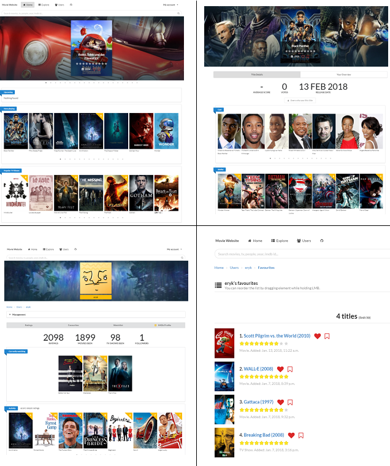

[](https://github.com/erykio/movie-website/actions/workflows/push-docker-image.yml) 
[](https://python.org)
[](https://djangoproject.com)


# About
https://movie.eryk.io

This is the first website I have ever built. At the time it was useful for me because it helped me with managing my IMDb.com movie and tv series ratings (my biggest problem with IMDb was that you couldn't rate the same title multiple times).

I wanted to learn web development, so I decided to pick the Django framework and after going through a few Django tutorials I decided to make my own website.
 
The first commit was added on **7 Jul 2016**, but now it is the end of 2021, and I am still working on this project because currently I am creating automated deployment processes for all of my past apps.

# Tech stack

* [Django](https://www.djangoproject.com/)
* [Django REST framework](https://www.django-rest-framework.org/)
* [Semantic UI](https://semantic-ui.com/)
* [Celery Task Queue](http://docs.celeryproject.org)
* Docker & Docker Compose

# Features
The IMDb and TMDB APIs have changed or stopped working since I created this app, so the app is not as functional as it was before.

* rate the same title multiple times
* add titles to your watchlist and favourites
* export/import your ratings in a csv format
* compare your ratings with other users
* asynchronous celery tasks for adding new movies & tv-shows using TMDB APIs
* IMDb.com integration (you could import ratings from your IMDb account and keep the ratings on both websites synchronized)

# Preview



# Local dev
To avoid issues with permissions you need to create 2 folders owned by a user with id=1000.
```
mkdir movie-static
mkdir movie-media
docker-compose up
```