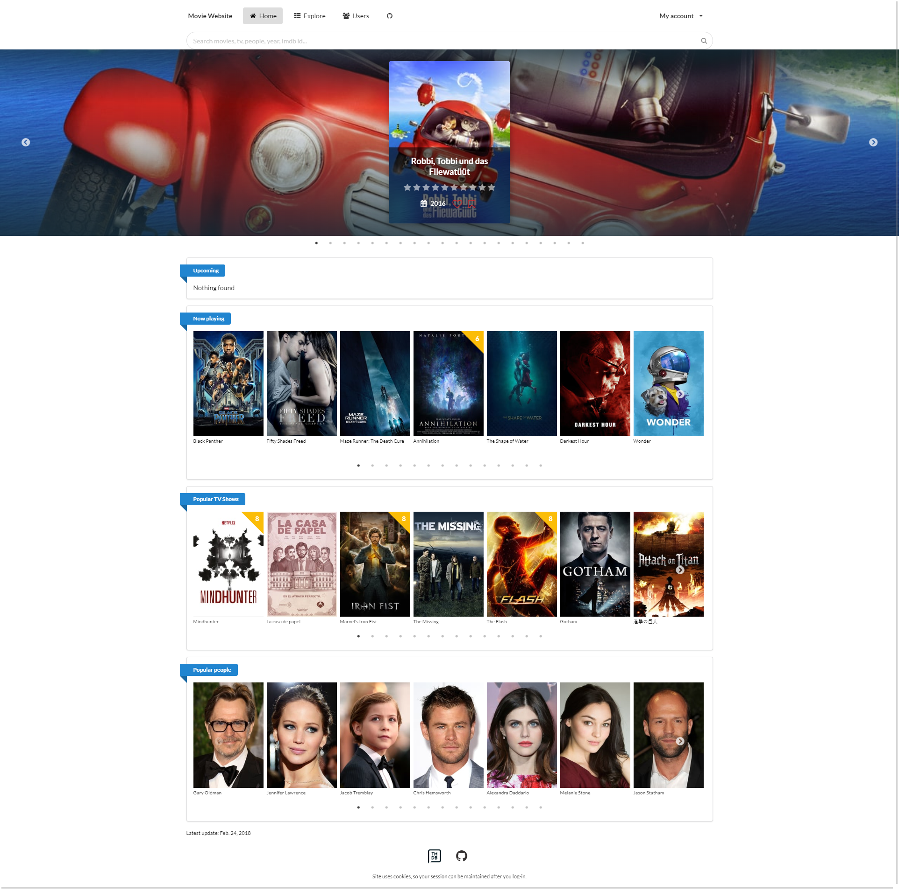

 

# About

http://movie.reryk.pl

Created for helping me with tracking watched movies/tv-shows.
It is helpful because if you rate again some title on IMDb, information about previous rating is overwritten. This site allows you to rate a title multiple times.

# How it worked*
### *As of Nov 2017, IMDb has deprecated their RSS feeds, and keeping ratings/watchlist in sync with IMDb account is not possible (in easy way).
* IMDb provides RSS feed for getting last 250 titles in your ratings/watchlist and also allows exporting your full ratings.
* You can import this exported file into your account
* If your IMDb's lists are public you can provide your IMDb ID in the settings and your ratings/watchlist you will be able to keep your ratings/watchlist in sync.

# Currently
I was finishing up this website knowing that there is no easy way to keep in sync my ratings/watchlist anymore (RSS feed deprecation). I did this because I wasn't happy with code quality at all (eg. I wasn't using any Class Based Views).
I will still be using this website, I will be exporting my full ratings and syncing them from time to time in that way. And maybe I will figure out some other way for updating them daily, as it was before.

# Used technologies:
* Semantic-UI - I am really happy that I replaced Bootstrap 3 with Semantic. They have a lot of useful built in components that I needed, and UI looks much better than previously.
* Celery - When I add a new title I store every info about it (basic info, similar titles etc), but each similar title is added with only basic info - because each title has similar titles and so on, it would lead to an infinite recursion. "Details" of those similar titles are fetched by Celery task when some user visits this title's page.
I also use Celery for imports/exports. You can import ratings from a file exported from IMDb or even from this site (eg. you can export other user's ratings and then add them to your account). Also there is a cronjob running daily celery task that fetches Popular titles/people.
* TMDB - great service for getting movie/tv data. Previously I have used OMDB API but they went private. TMDB allows for hotlinking posters so I don't have to store them on my VPS (which is really helpful because I don't have a storage for that because now I have a lot of more titles and use 4 different poster sizes for each)
* Let's Encrypt for SSL certificate
* Jquery sortable for reordering favourite list
* http://avatars.adorable.io/ for cool placeholder avatars
* https://www.toptal.com/designers/subtlepatterns/ for a placeholder poster images
* fabric - for ease work with command line
* decouple - for hiding private variables from setting files

# Successes
* I am happy with code quality now. I have removed so much of redundant code.
* I have a written a TMDB API wrapper which allows me for full title update (basic info and details) or to get only details.
* Finally I have added SSL! Thank you Let's Encrypt for a painless process.
* Took care about some basic VPS security once I saw in logs that every day something tries to log into my root account. I have disabled SSH password root login and installed fail2bin to restrict brute force attacks for other accounts. Also, I am not using root account for everything anymore and I use ssh keys now.

# Needed improvements
* tests
* figure out how to keep ratings/watchlist in sync every day
* possibility to add new titles on demand. Right new new titles are added when you try to import rating of title that didn't exist. With this feature I wouldn't even have to use IMDb. Maybe when search returns no results, add a button that will add it to the database.
* ordering. I have a basic search but titles cannot be reordered.
* see notifications when celery task has finished and see details about each import. For example, when you upload ratings I want user to know what ratings weren't imported and why (eg. title didn't exist couldn't be added).
* show on user profile what actors he likes the most or watched the most
* right now you can add titles to your Favourite list. You can reorder the list but I have limited its capacity to 50 because it was laggy to load 100 items. There must be a way to reorder paginated items.
* add pagination to watchlist (simpler because there is no reordering)
* charts! Previous version had HighCharts but they are missing from this one.

# Preview

---

---

---

